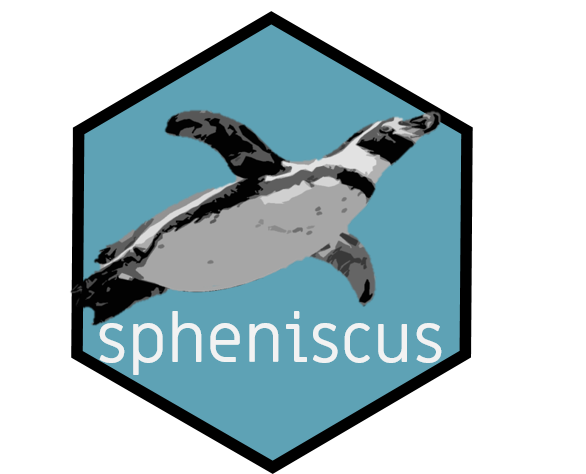

```{r, include = FALSE}
knitr::opts_chunk$set(
  collapse = TRUE,
  comment = "#>",
  fig.path = "man/figures/README-",
  out.width = "100%"
)
```

# spheniscus 


The goal of spheniscus is to:  
- Provide raw data from TDR (time and depth recorder) devices to get familiar with the format.  
- Helps to obtain diving parameters from the sampled individuals.  

**[Enlace en español](https://www.miriam-lerma.com/posts/2021-05-14-spheniscus/).**

## Installation

This package is to be only on the development version from [GitHub](https://github.com/).

```{r, eval=FALSE}
install.packages("devtools")
devtools::install_github("MiriamLL/spheniscus")
```

```{r example}
library(spheniscus)
```

## Data

### TDR_raw 📥

Includes raw data as object.

```{r, eval=FALSE}
TDR_raw<-TDR_raw
```

Loads raw data. Columns are not separated on purpose. 

### TDR_dives 🤿

Includes all dives during the foraging trip.

```{r, eval=FALSE}
TDR_dives<-TDR_dives
```

## Functions

### extract_rawdata 🧹

Extracts depth data from raw data.<br>
In devices TDR (Cefas G5+) the pressure starts to be recorded after the row 'Data Block 1' and the last recording is just before 'Data Block 2'. Therefore, these names were used as separators at row_start and row_end.<br>

```{r, eval=FALSE}
TDR_pressure<-extract_pressure(data=TDR_raw, 
                          row_start='Data Block 1', 
                          row_end = 'Data Block 2')
```

### extract_trip ✂️

Extracts data to have only periods of interest. <br>
This information was obtain from the GPS devices, trip_start is when the individual left the colony and trip_end when it returned.

```{r, eval=FALSE}
TDR_trip<-extract_trip(data=TDR_pressure,
                   timeformat="%d-%m-%Y %H:%M:%S",
                   trip_start="30-11-2018 20:43:24",
                   trip_end="01-12-2018 20:16:19")
```

### plot_depth 🎨

Creates a plot with the diving profile. Adds a red line for the zero.

```{r, eval=TRUE, fig.height=2}
plot_depth(TDR_trip = TDR_trip,
                   depth_column='Pressure',
                   time_column='daytime')
```


## correct_zero 📐

This function is to correct zeros, if manual correction is needed. <br>
In the example below I corrected the zero using -0.80 m. This is to be adjusted accordingly.  

```{r,eval=FALSE}
TDR_corrected<-correct_zero(TDR_trip = TDR_trip,
             depth_column='Pressure',
             extra_correction=-0.80)
```

You can plot the depth again to confirm that the zero was corrected.  

```{r, fig.height=2}
plot_depth(TDR_trip = TDR_corrected,
            depth_column='corrected_depth',
            time_column='daytime')
```

## identify_dives 🐟

This function identifies every dive as a individual dive, assigns a number, a mean diving depth, a maximum diving depth, a dive duration, a maximum dive duration. 
In the example, real dives were considered when the animal was deeper than 3 m from the surface.

```{r, eval=FALSE}
TDR_dives<-identify_dives(TDR_corrected=TDR_corrected,
               real_dives=3,
               depth_column='corrected_depth')
```


## dive_parameters 🤿

This function calculates the dive parameters from the foraging trip.  
It includes:  
- average maximum depth  
- standard deviation of the maximum depth  
- maximum depth during the trip  
- average dive duration  
- standard deviation of dive duration  
- maximum dive duration  
- total number of dives   
**Note** Diving depths are in meters, durations are in seconds

```{r}
dive_parameters<-calculate_diveparams(TDR_dives)
```

```{r, echo=FALSE}
knitr::kable(dive_parameters)
```

# Citation

This script is supporting information from a publication by Lerma et al. (in preparation)

Please citate the package as:  
Lerma, M (2021). Package spheniscus (Version v1.0). Zenodo. http://doi.org/10.5281/zenodo.4709837 

[](https://zenodo.org/badge/latestdoi/360213200)
