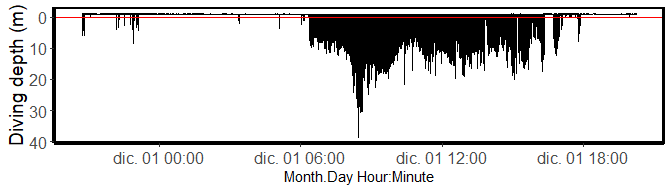
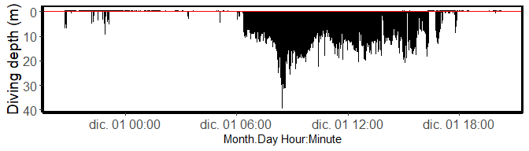

# spheniscus 🐧

El objetivo de este paquete es:  
- Hacer disponibles datos crudos de TDR para que se familiaricen con el
formato.  
- Ayudarte a limpiar los datos de TDR para obtener parametros de buceo
de los animales muestreados.

The goal of spheniscus is to:  
- Provide raw data from TDR (time and depth recorder) devices to get
familiar with the format.  
- Helps to obtain diving parameters from the sampled individuals.

## Installation

El paquete estará disponible solo por GitHub <br> This package is to be
only on the development version from [GitHub](https://github.com/).

``` r
install.packages("devtools")
devtools::install_github("MiriamLL/spheniscus")
```

``` r
library(spheniscus)
```

## Data

### TDR\_raw 📥

Agrega los datos crudos como objeto. <br> Includes raw data as object.

``` r
TDR_raw<-TDR_raw
```

Las columnas no estan separadas ya que primero hay que cortar partes del
archivo. <br> Loads raw data. Columns are not separated on purpose.

### TDR\_dives 🤿

Incluye todos los buceos durante el viaje. <br> Includes all dives
during the foraging trip.

``` r
TDR_dives<-TDR_dives
```

## Functions

### extract\_rawdata 🧹

Extrae la información de profundidad de los datos crudos de los
dispositivos. <br> En los dispositivos TDR (Cefas G5+) la presión se
empieza a medir después de ‘Data Block 1’ y termina de medir presión
cuando empieza ‘Data Block 2’. Estos nombres fueron usados como
separadores en row\_start y row\_end. Si tu dispositivo usa otros
separadores como por ejemplo ‘Data Block 0’ hay que ajustar acorde.<br>

Extracts depth data from raw data.<br> In devices TDR (Cefas G5+) the
pressure starts to be recorded after the row ‘Data Block 1’ and the last
recording is just before ‘Data Block 2’. Therefore, these names were
used as separators at row\_start and row\_end.<br>

``` r
TDR_pressure<-extract_pressure(data=TDR_raw, 
                          row_start='Data Block 1', 
                          row_end = 'Data Block 2')
```

### extract\_trip ✂️

Corta periodos de tiempo de acuerdo a nuestro interés. <br> La
información se obtuvo de dispositivos GPS, trip\_start es cuando
salieron de la colonia y trip\_end cuando regresaron.  
Los datos fueron recortados para incluir sólo información durante el
viaje de alimentación.

Extracts data to have only periods of interest. <br> This information
was obtain from the GPS devices, trip\_start is when the individual left
the colony and trip\_end when it returned.

``` r
TDR_trip<-extract_trip(data=TDR_pressure,
                   timeformat="%d-%m-%Y %H:%M:%S",
                   trip_start="30-11-2018 20:43:24",
                   trip_end="01-12-2018 20:16:19")
```

### plot\_depth 🎨

Crea un grafico con el perfil de buceos. Marca el cero con una linea
roja. <br> El objetivo de este gráfico es que te permita decidir si
debes corregir el cero.

Creates a plot with the diving profile. Adds a red line for the zero.

``` r
plot_depth(TDR_trip = TDR_trip,
                   depth_column='Pressure',
                   time_column='daytime')
```



## correct\_zero 📐

Esta función te permite corregir el cero usando un factor de corrección.
<br> En el ejemplo, corregí el cero usando -0.80 m. Este valor fue
ajustado de manera manual.

This function is to correct zeros, if manual correction is needed. <br>
In the example below I corrected the zero using -0.80 m. This is to be
adjusted accordingly.

``` r
TDR_corrected<-correct_zero(TDR_trip = TDR_trip,
             depth_column='Pressure',
             extra_correction=-0.80)
```

Puedes volver a crear el gráfico para confirmar que se corrigió el cero.

You can plot the depth again to confirm that the zero was corrected.

``` r
plot_depth(TDR_trip = TDR_corrected,
            depth_column='corrected_depth',
            time_column='daytime')
```



## identify\_dives 🐟

Esta función identifica identifica cada buceo como unidades
individuales, y les asigna a cada inmersión un numero, una profundidad
media de buceo, una profundidad máxima de buceo, una duración media de
buceo y una duración máxima de buceo.  
En el ejemplo, los buceos reales fueron considerados cuando el animal se
encontraba más profundo de 3 metros.

This function identifies every dive as a individual dive, assigns a
number, a mean diving depth, a maximum diving depth, a dive duration, a
maximum dive duration. In the example, real dives were considered when
the animal was deeper than 3 m from the surface.

``` r
TDR_dives<-identify_dives(TDR_corrected=TDR_corrected,
               real_dives=3,
               depth_column='corrected_depth')
```

## dive\_parameters 🤿

Esta función calcula los parámetros del viaje completo.  
Incluye:  
- promedio de la profundidad máxima de buceo,  
- desviación estándar de la profundidad máxima de buceo,  
- el máximo de profundidad, la duración promedio de los buceos,  
- la desviación estándar de la duración de los buceos, y  
- la duración máxima de buceo, así como  
- el total de buceos durante el viaje.  
**Nota** La profundidad de buceo se da en metros, la duración en
segundos.

This function calculates the dive parameters from the foraging trip.  
It includes:  
- average maximum depth  
- standard deviation of the maximum depth  
- maximum depth during the trip  
- average dive duration  
- standard deviation of dive duration  
- maximum dive duration  
- total number of dives  
**Note** Diving depths are in meters, durations are in seconds

``` r
dive_parameters<-calculate_diveparams(TDR_dives)
```

| max\_depth\_mean | max\_depth\_sd | max\_depth\_max | dive\_duration\_mean | dive\_duration\_sd | dive\_duration\_max | n\_dives |
|-----------------:|---------------:|----------------:|---------------------:|-------------------:|--------------------:|---------:|
|          11.7163 |       4.836995 |           39.21 |             18.86549 |           7.438373 |                  41 |      565 |

# Citation

Este script acompaña una publicacion en pingüinos por Lerma et al. (en
preparacion)  
This script is supporting information from a publication by Lerma et
al. (in preparation)

Please citate the package as:  
Lerma, M (2021). Package spheniscus (Version v1.0). Zenodo.
<http://doi.org/10.5281/zenodo.4709837>

[](https://zenodo.org/badge/latestdoi/360213200)
