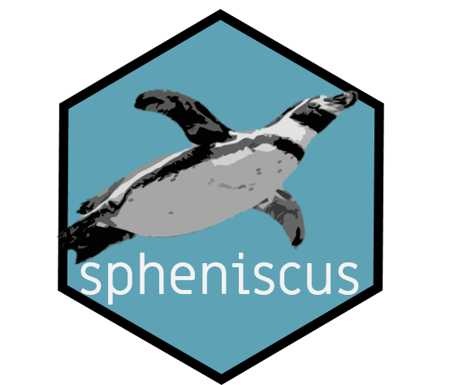

# spheniscus 

The goal of spheniscus is to:  
- Provides raw and clean data from TDRs devices (time and depth recorder) to get
familiar with the format.  
- Provides functions to clean the TDR data and to obtain diving parameters from the sampled individuals.

**[Enlace en
español](https://www.miriam-lerma.com/posts/2021-05-14-spheniscus/).**

## Installation

This package is to be only on the development version from
[GitHub](https://github.com/).

``` r
install.packages("devtools")
devtools::install_github("MiriamLL/spheniscus")
```

``` r
library(spheniscus)
```

## Data

### TDR\_raw 📥

Loads raw data as object.

``` r
TDR_raw<-TDR_raw
```

Loads raw data. Note that columns are not separated on purpose.

### TDR\_dives 🤿

Loads all dives during the foraging trip.

``` r
TDR_dives<-TDR_dives
```

## Functions

### extract\_rawdata 🧹

Extracts depth data from raw data.<br> In devices TDR (Cefas G5+) the
pressure starts to be recorded after the row ‘Data Block 1’ and the last
recording is just before ‘Data Block 2’. Therefore, these names were
used as separators at row\_start and row\_end.<br>

``` r
TDR_pressure<-extract_pressure(data=TDR_raw, 
                          row_start='Data Block 1', 
                          row_end = 'Data Block 2')
```

### extract\_trip ✂️

Cuts periods inside the data to have only periods of interest. <br> In the example, the information
was obtain from the GPS devices, trip\_start is when the individual left
the colony and trip\_end when it returned.

``` r
TDR_trip<-extract_trip(data=TDR_pressure,
                   timeformat="%d-%m-%Y %H:%M:%S",
                   trip_start="30-11-2018 20:43:24",
                   trip_end="01-12-2018 20:16:19")
```

### plot\_depth 🎨

Creates a plot with the diving profile. Adds a red line for the zero.

``` r
plot_depth(TDR_trip = TDR_trip,
                   depth_column='Pressure',
                   time_column='daytime')
```


## correct\_zero 📐

This function is to correct zeros, if manual correction is needed. <br>
In the example below I corrected the zero using -0.80 m. This is to be
adjusted accordingly.

``` r
TDR_corrected<-correct_zero(TDR_trip = TDR_trip,
             depth_column='Pressure',
             extra_correction=-0.80)
```

You can plot the depth again to confirm that the zero was corrected.

``` r
plot_depth(TDR_trip = TDR_corrected,
            depth_column='corrected_depth',
            time_column='daytime')
```


## identify\_dives 🐟

This function identifies every dive as a individual dive, assigns a
number, a mean diving depth, a maximum diving depth, a dive duration, a
maximum dive duration. In the example, real dives were considered when
the animal was deeper than 3 m from the surface.

``` r
TDR_dives<-identify_dives(TDR_corrected=TDR_corrected,
               real_dives=3,
               depth_column='corrected_depth')
```

## dive\_parameters 🤿

This function calculates the dive parameters from the foraging trip.  
It includes:  
- average maximum depth  
- standard deviation of the maximum depth  
- maximum depth during the trip  
- average dive duration  
- standard deviation of dive duration  
- maximum dive duration  
- total number of dives  
**Note** Diving depths are in meters, durations are in seconds

``` r
dive_parameters<-calculate_diveparams(TDR_dives)
```

| max\_depth\_mean | max\_depth\_sd | max\_depth\_max | dive\_duration\_mean | dive\_duration\_sd | dive\_duration\_max | n\_dives |
|-----------------:|---------------:|----------------:|---------------------:|-------------------:|--------------------:|---------:|
|          11.7163 |       4.836995 |           39.21 |             18.86549 |           7.438373 |                  41 |      565 |

# Citation

- This script is supporting information from a publication by Lerma et
al. (in preparation)

- Please citate the package as:  
Lerma, M (2021). Package spheniscus (Version v1.0). Zenodo.
<http://doi.org/10.5281/zenodo.4709837>

[](https://zenodo.org/badge/latestdoi/360213200)
